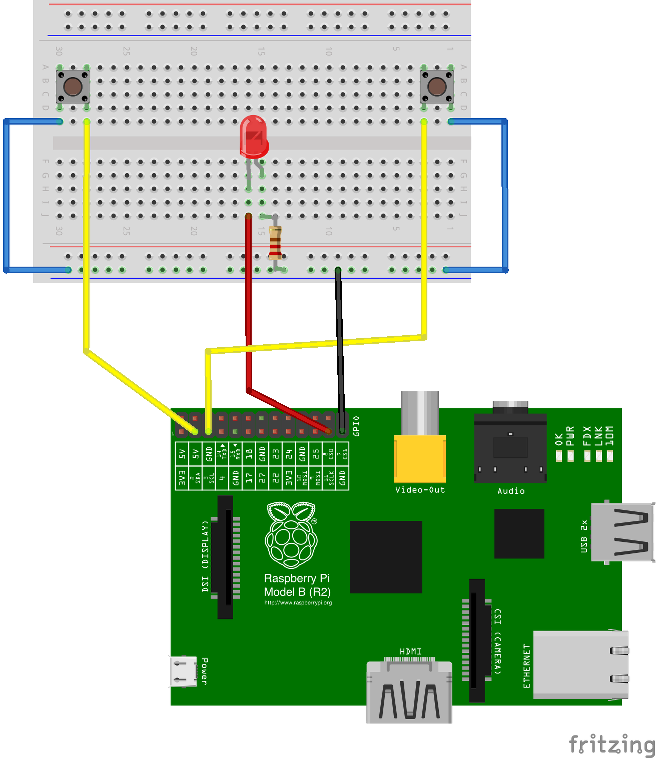
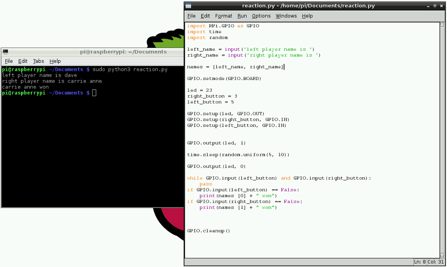

## Python Quick Reaction Game

**Introduction**

This project gives you the opportunity to use electronics to create a quick reaction game that you will program using Python. If you have little or no experience of creating circuits do not worry, this guide will walk you through it and by the end you will have a fun game to play with your friends.

## Step 0: Setting up your Raspberry Pi

You will need to set up your Raspberry Pi to take part in this activity. See the [Raspberry Pi Start Guide here](http://www.raspberrypi.org/help/quick-start-guide/) to get you up and running.

You will require the following components in order to create this game with your Raspberry Pi.
- A half size breadboard
- LED
- A resistor
- Four female to male jumper wires
- Two male to male jumper wires
- Two tactile buttons

## Step 1: Connect the Components

Before using Python the program the game, you will need to connect the electronic components on a **breadboard** that has lots of holes in it allowing you to connect electrical bits together really easily. To help know which pins to connect cables to it is recommended that you download and print a [Raspberry Leaf](https://github.com/simonmonk/wiki_images/raw/master/raspberry%20leaf%20r2.pdf) diagram and place it over the pinson your Raspberry Pi.

**Activity Checklist:**

1. Begin by placing all the components on a desk and make sure that you have space to work. Lay the breadboard lenthways (landscape).

2. Take one of your tactile buttons and push it into the holes on your breadboard, with one set of legs on row `A` and one set of legs on row `C`.

3. Repeat the last step with the second button only placing it at the other end of the breabdoard on the same row. See the diagram below.

4. Place an LED with the longer leg above the ridge in the breadboard in `H16` and the shorter leg in `G15` (the numbering will depend on your breadboard so make sure that you check the diagram below).

5. Next push one leg of the resistor into the same coloumn `15` as the short leg of the resistor and the other leg into a hole along the blue strip.

6. Time to add the jumper wires. Start by taking two male to male jumper wires and placing one side in a hole next to the outside leg of the lft hand button, and the other leg in a hole along the blue strip. Repeat this step with the right hand button.

7. Then with a male to female jumper wire, connect **GPIO 2** to a hole on the breadboard in line with the other leg of the left hand button. Repeat this step for the right hand button, only this time connecting it to **GPIO 3**.

8. Using another male to female jumper wire, connect **GPIO 11** to a hole on the breadboard in line with the long leg of the LED.

9. Finally with the remaining male to female jumper wire, connect a **GND** GPIO pin to the blue strip on the breadboard.

	

## Step 2: Controlling the Light

When programming it makes sense to tackle one problem at a time. This makes it easier to test your project at various stages. In this step you will use a python library to control the Raspberry Pi GPIO, set the mode of pin numbering that you are going to use, and then write a simple sequence to turn on and off the LED.

**Activity Checklist**

1. Open the Python programming enevironment **IDLE3** by double clicking the desktop icon, or by using the main menu, selecting *Programming* and then *IDLE3*.

	

2. Create a new test editor file by clicking on *File* and *New Window*

3. Save this file as **reaction.py** by clicking on *File* and *Save As*

4. First you will need to import the modules and libraries needed to control the GPIO pins on the Raspberry Pi. Type:

	```python
	import RPi.GPIO as GPIO
	import time
	```

5. 	Make sure the GPIO pins are ready

	```python
	GPIO.setmode(GPIO.BOARD)
	```

6. 	As you are outputting to an LED you need to set up the pin that that the LED connects to on the Raspberry Pi as an output. First by using a variable to name the pin and then by setting the output:

	```python
	led = 23

	GPIO.setup(led, GPIO.OUT)
	```
7. Next add a line to turn the LED on. The value `1` represents **on** and the value `0` represents **off**

	```python
	GPIO.output(led, 1)
	```
8. Now add a line to wait 5 seconds by typing:

	```python
	time.sleep(5)
	```

9. Then add a line to turn the LED off like this:

	```python
	GPIO.output(led, 0)
	```

10. Add the end of your program add `GPIO.cleanup()`. Using GPIO cleanup and exiting a program normally will clean up all the ports that you have used, ready to be used again.

11. Save the file by clicking on *File* and *Save*.

12. Finally test that it works by opening **LXTerminal** by double clicking the icon on the desktop. Then type `sudo python3 reaction.py`

If the LED does not come on for 5 seconds, go back and see if you can work out what went wrong. This is a very important skill in computing called **debugging*. Finding errors or bugs in your code and fixing them.


## Step 3: Adding an Element of Surprise

The object of the game is to see who can press the button first when the light goes out so it would be better if the length of time it stayed on for were random. You need to add and amend some lines of code in your Python program so far.

**Activity Checklist:**

1. If the file **reaction.py** is not already open in IDLE3 then open it by clicking on *File* and *Open*.

2. Underneath **import time** add the following line:

	```python
	import random
	```

3. Then locate the line `time.sleep(5)` and amend it so that it reads:

	```python
	time.sleep(random.uniform(5, 10))
	```

4. Save your work by clicking on *file* and *save*. Test that it works bin an LXTerminal window by typing `sudo python3 reaction.py`


## Step 4: Detecting the Buttons

The LED is working, now you want to add functionality to your program so that when a button is pressed it is detected. That way you can record the scores of the players to see who wins. The way do this is to have a loop that keeps going until one of the buttons is pressed.
One odd thing is that the buttons are on if they are not pressed and off when they are. This is why the code says 'Left button pressed' when it finds that 'leftButton' is 'False'.

As with the last step, some code needs to be added to your current program.

**Activity Checklist:**

1. With the file **reaction.py** open add the following variables underneath `led = 23`

	```python
	right_button = 3
	left_button = 5
	```

2. Next set the buttons as input in the same way that you set the LED as output. Underneath `GPIO.setup(led, GPIO.OUT)` type:
	```python
	GPIO.setup(right_button, GPIO.IN)
	GPIO.setup(left_button, GPIO.IN)
	```
3. Then underneath `GPIO.output(led, 0)` add the button loop that waits until a button has been pressed:

	``` python
	while GPIO.input(left_button) and GPIO.input(right_button):
    	pass
	if GPIO.input(left_button) == False:
    	print("Left button pressed")
	if GPIO.input(right_button) == False:
    	print("Right button pressed")
	```

	Each time around this loop the Raspberry Pi checks if a button has been pushed and if one has then a statement is printed to the screen to indicate that it has been pushed.

	Notice that the line after `while` is **indented** (it has paces at the start). Python 	knows which lines are in the loop (and also for the `if` blocks) by how far they are 	indented, so make sure you put the spaces in correctly. The IDLE3 text editor should do 	much of this for you, but make sure you check it.

4. Save your program and test it with a friend.

## Step 5: Get Player Names

Wouldn't it be better if the program told you who has won instead of just which button was pressed? For this, you need to find out the players names. In python you can use **input**. In Python 3 use the syntax `input` (which you have been using so far) You could write your code in Python 2 which means that you need to use `raw_input` instead.

**Activity Checklist:**

1. 	To find out the names of the players you can use `input` to ask the players to type in their names. Underneath the imported libraries and modules type:

	```python
	left_name = input('left player name is ')
	right_name = input('right player name is ')
	```

2. 	Next type the following code to put the inputted names into a list:

	```python
	names = [ left_name, right_name ]
	```

3. 	Then go down to the button loop and replace `print("Left button pressed")` with `print(names [0] + " won")` like 			this:

	```python
	if GPIO.input(left_button) == False:
	  print(names [0] + " won")
	```

4. 	Repeat the last step replacing `print "Right button pressed"` with `print(names [1] + " won")`

	```python
	if GPIO.input(right_button) == False:
	  print(names [1] + " won")
	```

5. 	Save **reaction.py** and test your game to see if it works.



## Things to try:

- Add scores for both players that accumilate over a number of rounds.

## Community

This activity is based on the work of [Joseph Haig at his Code Club](https://github.com/jrmhaig/rpi_projects)

## Licence

Unless otherwise specified, everything in this repository is covered by the following licence:


***Quick Reaction Game*** by the [Raspberry Pi Foundation](http://raspberrypi.org) is licenced under a [Creative Commons Attribution 4.0 International License](http://creativecommons.org/licenses/by-sa/4.0/).

Based on a work at https://github.com/raspberrypilearning/quick-reaction-game
