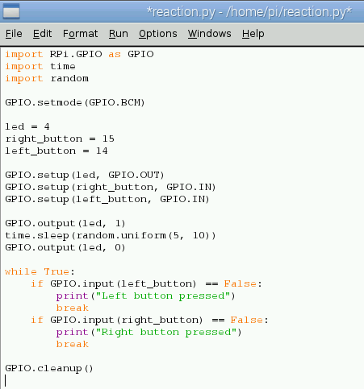
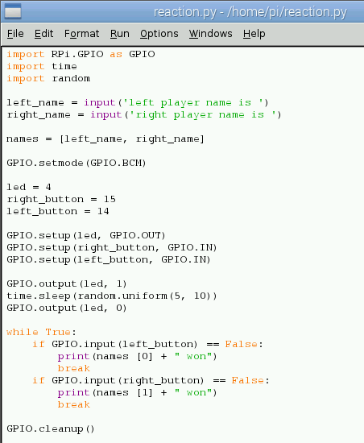

# Quick Reaction Game

## Connect the components

Before using Python to program the game, you will need to connect the electronic components on a **breadboard** that has lots of holes in it, allowing you to connect electrical bits together really easily.

*Using a breadboard allows you to connect electronic components to each other without having to solder them together. They are often used to test a circuit design before creating a Printed Circuit Board (PCB). The holes on the breadboard are connected in a pattern. With most breadboads, the top row of holes are all connected together – marked with red dots.  And so are the second row of holes – marked with blue dots and we call this the ground rail.  The same goes for the two rows of holes at the bottom of the breadboard. In the middle, the columns of wires are connected together with a break in the middle.*

1. Begin by placing all the components on a desk and make sure that you have space to work. Lay the breadboard lengthways (landscape).

1. Looking at the following GPIO diagram, compare it to your Raspberry Pi. 

    *GPIO stands for **General Purpose Input Output**. It is a way in which the Raspberry Pi can control and monitor the outside world by being connected to electronic circuits.  The Pi is able to control LEDs, turning them on or off, or motors, or many other things.  It is also able to detect whether a switch has been pressed, or temperature, or light.*

    You'll be using a single ground pin (marked `GND`) and several GPIO pins (marked `GPIO`):

|            |            |
|-----------:|:-----------|
|    3V3     | 5V         |
|  **GPIO2** | 5V         |
|  **GPIO3** | GND        |
|  **GPIO4** | **GPIO14** |
|        GND | **GPIO15** |
| **GPIO17** | **GPIO18** |
| **GPIO27** | GND        |
| **GPIO22** | **GPIO23** |
|        3V3 | **GPIO24** |
| **GPIO10** | GND        |
|  **GPIO9** | **GPIO25** |
| **GPIO11** | **GPIO8**  |
|        GND | **GPIO7**  |
|        DNC | DNC        |
|  **GPIO5** | GND        |
|  **GPIO6** | **GPIO12** |
| **GPIO13** | GND        |
| **GPIO19** | **GPIO16** |
| **GPIO26** | **GPIO20** |
|        GND | **GPIO21** |

Note that if you have an older Raspberry Pi model you'll only have 26 pins but they have the same layout, starting at the top row (`3V3` and `5V` and ending at `GND` and `GPIO7`).

1. Take one of your tactile buttons and push it into the holes on your breadboard, with one set of legs on row `H` and one set of legs on row `J`.

1. Repeat the last step with the second button, only placing it at the other end of the breadboard on the same row. See the diagram below.

1. Place an LED with the longer leg above the ridge in the breadboard in `D16` and the shorter leg in `D15`. The numbering will depend on your breadboard so make sure that you check the diagram below.

	*LED stands for Light Emitting Diode, and glows when electricity is passed through it. It has one leg longer than the other. This is important as it tells us which way round the LED should be placed into a circuit in order for the current to flow through it and make it work. The longer leg (known as the ‘anode’), is always connected to the positive supply of the circuit. The shorter leg (known as the ‘cathode’) is connected to the negative side of the power supply, known as ‘ground’.*

1. Next push one leg of the resistor into the same column `15` as the short leg of the resistor and the other leg into a hole along the blue strip.

	 *Resistors are a way of limiting the amount of electricity going through a circuit; specifically, they limit the amount of ‘current’ that is allowed to flow.  The measure of resistance is called the Ohm (Ω), and the larger the resistance, the more it limits the current.  The value of a resistor is marked with coloured bands along the length of the resistor body. In this circuit a 330Ω should provide enough resistance so that too much current does not overpower the LED.*

1. Time to add the jumper wires. Start by taking two male-to-male jumper wires and placing one side in a hole next to the outside leg of the left hand button, and the other leg in a hole along the blue strip. Repeat this step with the right hand button.

	*Jumper wires are used on breadboards to ‘jump’ from one connection to another.  The ones you will be using in this circuit have different connectors on each end.  The end with the ‘pin’ will go into the Breadboard.  The end with the piece of plastic with a hole in it will go onto the Raspberry Pi’s GPIO pins.*

1. Then with a male-to-female jumper wire, connect **GPIO14** to a hole on the breadboard in line with the other leg of the left hand button. Repeat this step for the right hand button, only this time connecting it to **GPIO15**.

1. Using another male-to-female jumper wire, connect **GPIO4** to a hole on the breadboard in line with the long leg of the LED.

9. Finally, connect a **GND** GPIO pin to the blue strip on the breadboard with the remaining male-to-female jumper wire.

	

## Controlling the light

When programming it makes sense to tackle one problem at a time. This makes it easier to test your project at various stages. In this step you will use a Python library to control the Raspberry Pi GPIO, set the mode of pin numbering that you are going to use, and then write a simple sequence to turn the LED on and off.

1. Click on the **Terminal** application icon on the taskbar or click on **Main Menu**, **Accessories** and **Terminal**. 

    Once loaded type `sudo idle3 &` and press enter on the keyboard. This will load the Python 3 programming environment called `IDLE3` as the super user which allows you to create a program that affects the GPIO pins. Once loaded click on **file** and **new window**.

1. Create a new test editor file by clicking on *File* and *New Window*.

1. Save this file as **reaction.py** by clicking on *File* and *Save As*.

1. First you will need to import the modules and libraries needed to control the GPIO pins on the Raspberry Pi. Type:

	```python
	import RPi.GPIO as GPIO
	import time
	```

1. 	Make sure the GPIO pins are ready:

	```python
	GPIO.setmode(GPIO.BCM)
	GPIO.setwarnings(False)
	```

1. 	As you are outputting to an LED, you need to set up the pin that the LED connects to on the Raspberry Pi as an output. First use a variable to name the pin and then set the output:

	```python
	led = 4

	GPIO.setup(led, GPIO.OUT)
	```
	
1. Next add a line to turn the LED on. The value `1` represents **on** and the value `0` represents **off**:

	```python
	GPIO.output(led, 1)
	```
	
1. Now add a line to wait 5 seconds by typing:

	```python
	time.sleep(5)
	```

1. Then add a line to turn the LED off like this:

	```python
	GPIO.output(led, 0)
	```

1. At the end of your program add `GPIO.cleanup()`. Using GPIO cleanup and exiting a program normally will clean up all the ports that you have used, ready to be used again.

1. Save the file by clicking on *File* and *Save*.

1. Finally, test that it works by click on **Run** followed by **Run Module** or by pressing `F5` on the keyboard.

If the LED does not come on for 5 seconds, go back and see if you can work out what went wrong. This is a very important skill in computing called **debugging*, which is finding errors or bugs in your code and fixing them.


## Adding an element of surprise

The object of the game is to see who can press the button first when the light goes out, so it would be better if the length of time it stayed on were random. You need to add and amend some lines of code in your Python program so far.

1. If the file **reaction.py** is not already open in IDLE3 then open it by clicking on *File* and *Open*.

1. Underneath **import time** add the following line:

	```python
	import random
	```

1. Then locate the line `time.sleep(5)` and amend it so that it reads:

	```python
	time.sleep(random.uniform(5, 10))
	```

4. Save your work by clicking on *File* and *Save*. Test that it works by pressing `F5`.


## Step 4: Detecting the buttons

The LED is working; now you want to add functionality to your program so that when a button is pressed it is detected. That way you can record the scores of the players to see who wins. The way do this is to have a loop that keeps going until one of the buttons is pressed.

One odd thing is that the buttons are on if they are not pressed and off when they are. This is why the code says 'Left button pressed' when it finds that 'leftButton' is 'False'.

As with the last step, some code needs to be added to your current program.

1. With the file **reaction.py** open add the following variables underneath `led = 4`:

	```python
	right_button = 15
	left_button = 14
	```

2. Next set the buttons as input in the same way that you set the LED as output. Underneath `GPIO.setup(led, GPIO.OUT)` type:
	
	```python
	GPIO.setup(right_button, GPIO.IN, GPIO.PUD_UP)
	GPIO.setup(left_button, GPIO.IN, GPIO.PUD_UP)
	```
	
3. Then underneath `GPIO.output(led, 0)` add the button loop that waits until a button has been pressed:

	``` python
	while True:
	    if GPIO.input(left_button) == False:
    	    	print("Left button pressed")
    	    	break
    	    if GPIO.input(right_button) == False:
    	        print("Right button pressed")
    	        break
	```

	Each time around this loop the Raspberry Pi checks if a button has been pushed; if one has, then a statement is printed to the screen to indicate that it has been pushed.

	Notice that the line after `while True:` is **indented** (it has spaces at the start). Python knows which lines are in the loop (and also for the `if` blocks) by how far they are indented, so make sure you put the spaces in correctly. The IDLE3 text editor should do much of this for you, but make sure you check that there are 4 spaces.

	

4. Save your program and test it with a friend.

## Get player names

Wouldn't it be better if the program told you who has won instead of just which button was pressed? For this, you need to find out the players' names. In Python you can use **input** for this. In Python 3 use the syntax `input` (which you have been using so far). You could write your code in Python 2, which means that you need to use `raw_input` instead.

1. 	To find out the names of the players you can use `input` to ask the players to type in their names. Underneath the imported libraries and modules type:

	```python
	left_name = input('left player name is ')
	right_name = input('right player name is ')
	```

2. 	Next type the following code to put the inputted names into a list:

	```python
	names = [ left_name, right_name ]
	```

3. 	Then go down to the button loop and replace `print("Left button pressed")` with `print(names [0] + " won")` like this:

	```python
	if GPIO.input(left_button) == False:
	  print(names [0] + " won")
	```

4. 	Repeat the last step, replacing `print "Right button pressed"` with `print(names [1] + " won")`:

	```python
	if GPIO.input(right_button) == False:
	  print(names [1] + " won")
	```

5. 	Save **reaction.py** and test your game to see if it works.



## What's next?

- Add scores for both players that accumulate over a number of rounds.

## Community

This activity is based on the work of [Joseph Haig at his Code Club](https://github.com/jrmhaig/rpi_projects).
